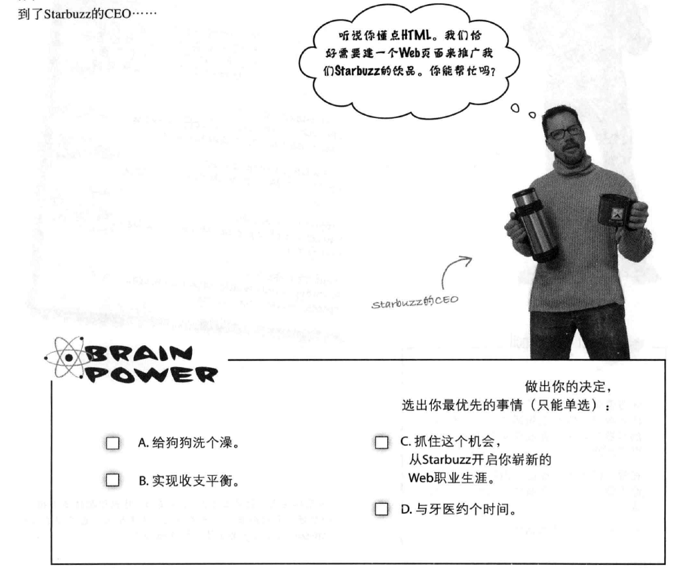
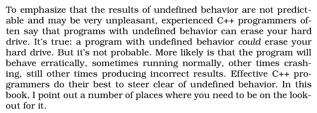
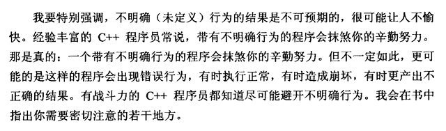
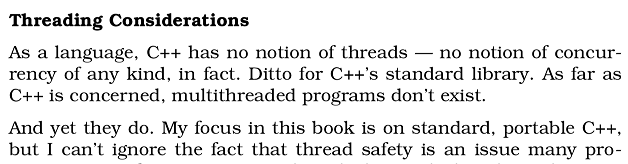
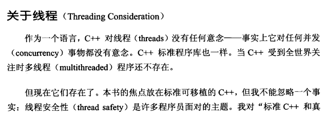

# 原版书 versus 翻译版书

先说结论：对于原版书籍，有条件一定要阅读英文原版，不要读翻译版本。

给你几个实例，翻译版都是正规出版社聘请水平较高的从业人员（其中不乏知名人士）译制的。

## 示例一

本书的前 8 页作者介绍了一些制作网页的基础知识，然后这里 CEO 找上门来让你帮忙做一个网页，你是帮忙呢，还是帮忙呢，还是帮忙呢。可见 A、B、D 选项都是原作者跟你小小幽默一下。但是你看中文版的“B.实现收支平衡。”……这是什么鬼？不结合英文版你能看出它的意思？

## 示例二

原文有这样一段话

>... the results of undefined behavior ... may be very unpleasant ... can erase your hard drive ...

侯捷老师的译文中直接把“hard drive”解释为“辛勤努力”，首先明确一下“hard drive”确实有两层含义：

- 硬盘
- 辛勤努力

但是结合上下文看，这句话是“experienced programmer”对未定义行为所带来的“very unpleasant”的后果的一种假设。同志们，experienced programmer 啊！他怎么可能这么文艺的说“你的辛勤努力毁于一旦”，只有实实在在的删除硬盘信息才足够 unpleasant，足够理工科嘛。由于 hard drive 的两层含义，原文一语双关，但是侯捷老师忽略掉了这里的另一层（更实际）的意思，使得译文欠缺了那么一点点戏剧效果。

## 示例三

讲解线程的部分有一句话：

>As far as C++ is concerned, multithreaded programs don’t exist. 
>And yet they do.

侯老师是这样翻译的：

>当 C++ 受到全世界关注时多线程程序还不存在。 
>但现在它们存在了。

首先，这句话不存在事实错误，如果抛开原文来阅读，这段译文所在的段落逻辑上也成立，因为本书成书于 2005 年，C++ 是在 2011 年官方引入多线程概念的。但症结在于侯老师把“as far as ... is concerned”理解错了，这个短语是固定用法，“as far as I am concerned”的意思是“在我看来”，所以这里作者的本意应该是“在 C++ 看来……”，接下一段的“And yet they do...”，作者的本意是：“C++ 自身不关心多线程，但多线程是一个不能忽略的概念。”由于有了上文的错误印象，侯老师继续错误将“yet”推断为“现在”，一套连环错误，侯老师把原意曲解成了：“C++ 受到人们关注的时候还不存在多线程，但到现在出现了多线程。”

当然这里我无意冒犯权威，还是那天那句话，**如果译者对原文把控有一点点的闪失，意思就会欠缺很多。** 你有得天独厚的条件，不要害怕阅读技术类的英文原著，一般都不会有太晦涩的措辞，而且遇到那些不懂的、专业词汇，可以随读随查。随着阅读、实践的深入，你头脑里慢慢会建立起一个专业词汇的中英文对照表，那时就不会有任何障碍了。

>【习题】尝试重新翻译一下上面三段英文，并试着阅读一些原著的内容，体会一下英语母语作者的思路和国内作者思路的区别。