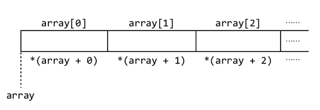

# 指针与数组

让我们透过现象观察一些本质，说到本质：**指针和数组在本质上是相通的**：

我们用 `type_name variable` 语句来声明一个变量，就是告诉编译器：“接下来我要使用一个 `type_name` 类型的变量，我给他起名叫 `variable`，请分配给它足够的内存，大小为 [`sizeof`](https://en.cppreference.com/w/c/language/sizeof)`type_name`”。

数组的情况略有不同：`type_name array[10]` 即：“接下来我要用一个数组，这个数组里边有 10 个元素，每个元素都是 `type_name` 类型的，我给这个数组起名为 `array`，请给我分配 `(sizeof typename) * 10` 这么多的内存。”

那么访问 `array[1]` 是怎样进行的呢？我们把刚才分配的内存想象成 10 份，让一个 `pointer_to_array` 指向这 10 份里的第 1 份，向后挪 1 位，就得到了 `array[1]`。

可见，C 语言并不是包装出了完美的数组格式，而是用指针指向数组申请的内存空间的特定位置，从而得到一组数据。这里的数组的名称 `array` 就是 `pointer_to_array`，每为`array`加 1，数组就向后移动一个身为，`array + 1` 保存着数组中第 2 个元素的地址，以此类推。要得到 `array[i]`，只需 `*(array + i)` 就 OK 了，二者是等价的。



现在我们粗略地了解了指针的第二个作用：**可参与数组元素的操作。** 这个概念比较抽象，通过一段时间的练习才能慢慢体会，体会到了数组和指针之间的关系，你也就能完全读懂直方图代码了。

>注：我们这里只是粗略了解，二者都可以作为操作内存的首地址符号，实际二者在使用时还是有细微区别的，这涉及了更多的知识，以后再说。

为了对指针和数组的关系形成更深刻的印象，请完成以下习题：

>【习题】到网上搜索一下[凯撒密码](https://en.wikipedia.org/wiki/Caesar_cipher)（英文页面有些专业名词，建议对照着中文页面看，如果你能访问的话:）的概念（只看概念，不要偷看别人写的代码哦），编写以下两个函数：
>```c
>// encrypt 函数：将长度为 length 的明文 text 按照偏移量 key 进行加密。
>void encrypt(char * text, int length, int key);
>// decrypt 函数：将长度为 length 的凯撒密文 text 按照偏移量 key 解密。
>void decrypt(char * text, int length, int key);
>```
>思考一下可不可以去掉 `length` 参数。