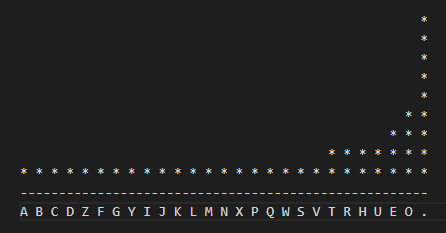

# 很高兴你坚持到现在

本文的最后一个话题，名字先卖个关子，这是 C 语言中最古怪的一种语法。

排序现在对你来说还很深奥，你非常期望有一个库函数来帮你解决造轮子的问题，那么你认为库中是否存在普适的 `sort` 函数，能够对任意数据类型的数组进行排序呢？

明确地告诉你，我们现在的知识边界内，不能。这是因为排序算法中肯定会比较两个元素的大小，就像前面涉及的，为 `int` 数组排序只需直接比较两个元素的值，而为 `charfq` 数组排序，就要比较 `charfq` 的 `frequency` 成员。显然这是单独一个 `sort` 函数无法解决的问题。

我再明确地告诉你，C 语言标准库中确实有一个为任意类型的数组排序的函数 `qsort`。

我的天哪。[手动岳云鹏捂嘴]这怎么做到的。

举一个比较具体的例子：

>你手里有两摞东西：
>
>- A - K 共 13 张扑克牌；
>- 1分 2分 5分 1毛 2毛 5毛 1块 5块 10块 20块 50块 100块 500块 共 13 张纸币；
>
>两摞都打乱了顺序，要你给它们排序。

由于你在得到了要排序东西的数组时，已经了解了比较大小的方式，只要根据固定的排序步骤，即使给你 13 个小姐姐让你按胸围大小排序你也可以如法炮制。

种类不同，比较大小的方法就不同，但是排序的步骤可以始终如一。

现在，掌握了固定排序步骤的你——就是 `qsort` 函数，针对各种各样的情况，你只要知道：要排序元素的种类、有多少个、比较大小的方法是怎样的。就能为它们排序了。

下面我们看看标准库的 `qsort` 函数的定义：

```c
void qsort( void *ptr,
            size_t count,           // size_t is an unsigned integer defined in the library,
            size_t size,            // ignore it, consider it as an int. 
            int (*comp)(const void *, const void *) );
```

依次介绍这四个参数：（算了还是先说中间两个吧）

`count` 指明数组中元素的个数，`size` 指明每个元素的大小（为了让函数了解元素的类型，细节略）。

`ptr` 就是要排序的数组的首指针。为什么传入一个 `void` 指针呢？这里涉及到**类型转换**的知识（如果想不起来了可以先去翻翻课本或 C Primer 再回来），因为 `qsort` 不关心类型，就需要传入数组是类型无关的，C 语言处理这类情况都是使用 `void *` 的方式，佛曰：色即是空，一切数组的形形色色的类型，来到 `qsort` 里都被视为“空类型”，以便对各种不同类型的元素进行无差别排序操作。

```c
char chars[10] = { . . . };
int ints[10] = { . . . };
typedef struct pretty_girl { . . . } pretty_girl;
pretty_girl gilrs[10] = { . . . };

qsort(chars, 10, sizeof(char), . . . );         // OK
qsort(ints, 10, sizeof(int), . . . );           // OK
qsort(girls, 10, sizeof(pretty_girl), . . . );  // OK, sort them indistinguishably.
```

下面来到本节开头说的 C 语言最古怪的语法。behold the legendary **function pointers**。

迄今为止，我们所接触到的函数参数都是各种数据类型的**量**；但是当我们需要传给函数一个**方法**的时候，就需要传递给它另一个函数，这时就需要用到**函数指针**，我们观察 `qsort` 的第四个参数：

```c
int (*comp)(const void *, const void *)
```

很明显，它是一个**函数签名**，它是一个名为 `*comp`（函数指针）的、接收两个 `const void *` 类型参数的、返回一个 `int` 值的函数。你可以自己编写这个 `comp` 函数，来实现 `charfq` 类型的比较。

```c
int compare_charfq(const void * _charfq1, const void * _charfq2) {
    int fq1 = (*(const charfq *)_charfq1).frequency;
    int fq2 = (*(const charfq *)_charfq2).frequency;
    return (fq1 > fq2) - (fq1 < fq2);
}
```

准备工作完毕，我们就可以调用 `qsort` 函数了：

```c
qsort( (void **)char_table,
       KINDS_OF_CHAR,
       sizeof(charfq),
       (int(*)(const void *, const void*))compare_charfq );
```

是不是有些眼花缭乱？`qsort` 里类型转换的问题能靠语言的特性自行解决，你只需要这样写就行了：

```c
qsort(char_table, KINDS_OF_CHAR, sizeof(charfq), compare_charfq);
```

努力尝试一下看能不能够编出来，实在弄不出来也没有关系，把[我写的这份](answers/stat.c)看懂，也是有一定帮助的。



这是在我的电脑上的运行结果，你可能会发现经过了排序，只出现一次的那些并列倒数第一们，没有按照原来的顺序排列，这说明标准库的 `qsort` 是一个**不稳定**的排序算法。排序真的是一个大问题，这一个话题就够讲这篇文章的篇幅的。等你大二时抽空再说。还有，在你的电脑上运行时，可能这些倒数第一们的顺序和我这个不一样，这说明不同版本的库，实现方法可能是不一样的。

本文的最后两个小练习：

>【习题1】 将上文中直方图里的项目降序排列。（尽量不参考现成的代码，独立完成。）
>
>【习题2】 还记得上文的成绩单的习题吗？既然你的代码中给那个保存同学信息的数组叫 `data_base` 了，我们就给它起个名字**学生数据库**，完成以下操作：
>- 从学生数据库中筛选出成绩合格的同学，打印成绩单。
>- 编写一个 `int find_score(student * data_base, char * name)` 函数，根据姓名寻找他的分数，作为返回值返回。
>- 将学生数据库里的所有记录按成绩高低排序，打印排行榜。
>- 编写一个 `student erase_student(student * data_base, int index)` 函数，将学生数据库中第 `index` 条记录删除，并将要删除的同学以返回值的形式返回。（注意删除后数据库中不要留下空的记录）